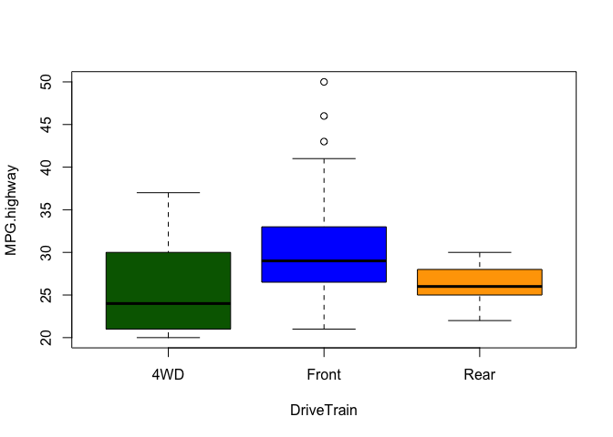
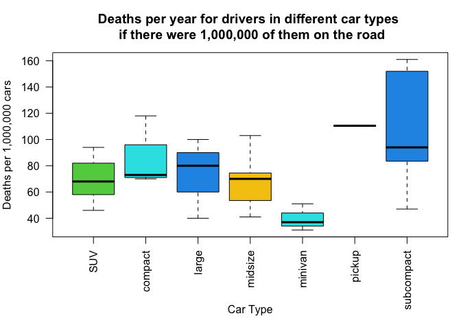
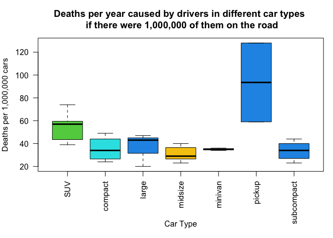
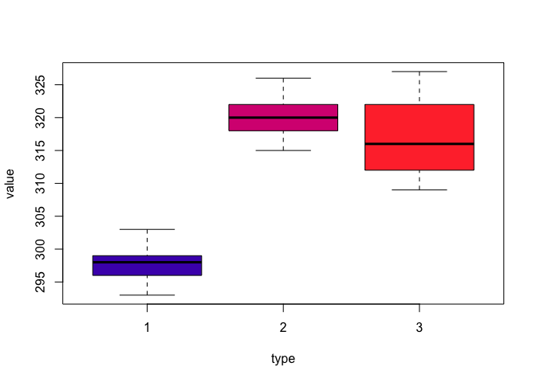
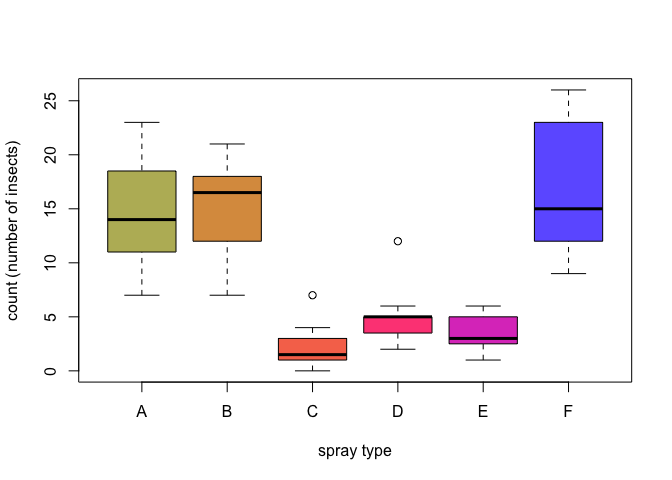
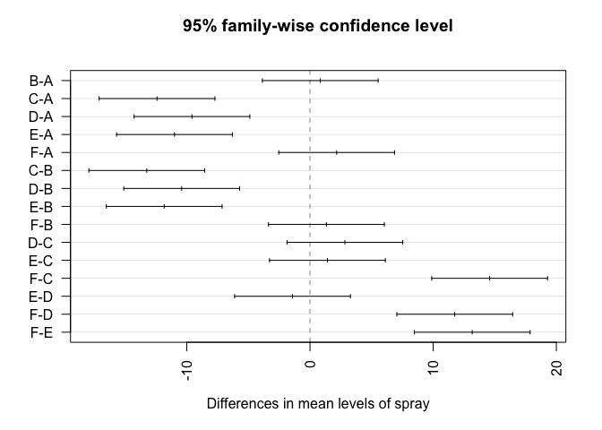

# Problem 1 (Verzani problem 12.2)

*For the data set `Cars93` (**MASS**) perform a one-way analysis of variance of
`MPG.highway` for each level of `DriveTrain`. Does the data support the null
hypothesis of equal population means? (Use `aov()` for this problem.)*


#### Solution

```r
#check equal variances
boxplot(MPG.highway~DriveTrain, data = Cars93, col = c("darkgreen", "blue", "orange"))
```

<div class="figure" style="text-align: center">

<p class="caption">Variances appear to differ a bit more than we would like, but we will still carryout the test</p>
</div>

```r
#check normality
shapiro.test(Cars93$MPG.highway) #Shapiro test results do not strongly indicate a normal distribution, but we'll proceed anyway
```

```
## 
## 	Shapiro-Wilk normality test
## 
## data:  Cars93$MPG.highway
## W = 0.92443, p-value = 4.576e-05
```

```r
#conduct ANOVA test
result = aov(MPG.highway~DriveTrain, data = Cars93)
summary(result)
```

```
##             Df Sum Sq Mean Sq F value  Pr(>F)   
## DriveTrain   2  320.1   160.1   6.276 0.00281 **
## Residuals   90 2295.2    25.5                   
## ---
## Signif. codes:  0 '***' 0.001 '**' 0.01 '*' 0.05 '.' 0.1 ' ' 1
```
We get a p-value of 0.00281 which is smaller than 0.05, so we reject $H_0$ and have reason to believe that the means of each group are not all the same.

</br>

# Problem 2 (Verzani problem 12.4)

*The data set `carsafety` (**UsingR**) contains car-crash data. For several
makes of cars the number of drivers killed per million is recorded in
`Drivers.deaths`. The number of drivers of other cars killed in accidents with
these cars, per million, is recorded in `Other.deaths`. The variable `type` is a
factor indicating the type of car.*

*Perform a one-way analysis of variance of the model `Drivers.deaths ~ type`. Is
there a difference in population means? Did you assume equal variances? Normally
distributed populations?*

*Repeat with an analysis of variance of the model `Other.deaths ~ type`. Is
there a difference in population means? (Use `oneway.test()` for this problem.)*

#### Solution

```r
#First we will check for normality of the data
shapiro.test(carsafety$Driver.deaths)
```

```
## 
## 	Shapiro-Wilk normality test
## 
## data:  carsafety$Driver.deaths
## W = 0.93052, p-value = 0.03622
```

```r
#Now construct a boxplot to look at variance of each type
par(mar=c(7,4,4,1))
boxplot(Driver.deaths~type, data = carsafety, las = 2, xlab = "", ylab = "Deaths per 1,000,000 cars", main = "Deaths per year for drivers in different car types \n if there were 1,000,000 of them on the road", col = carsafety$type)
mtext("Car Type", 1, line = 5)
```


</br>
It appears that the groups of SUV, Compact, Large, and Midsize have similar variances, while Minivan, pickup, and Subcompact appear to have different variances. Additionally, the Shapiro test does not strongly indicate a normal distribution, but we'll proceed anyway.

With ANOVA, our null hypothesis $H_0$ is $\mu_1 = \mu_2 =  ... = \mu_n$, and the alternate hypothesis $H_a$ is that not all means are equal. Now, run the ANOVA test using oneway.test:

```r
oneway.test(Driver.deaths~type, data = carsafety, var.equal = TRUE)
```

```
## 
## 	One-way analysis of means
## 
## data:  Driver.deaths and type
## F = 3.3463, num df = 6, denom df = 26, p-value = 0.01407
```
We get a p-value of 0.01407 which is smaller than 0.05, so we reject $H_0$ and have reason to believe that the means of each group are not all the same.

</br>
Now, repeat the procedure but for Other.deaths ~ type, which is the number of deaths in other vehicles caused by accidents involving the studied cars:

```r
#First we will check for normality of the data
shapiro.test(carsafety$Other.deaths)
```

```
## 
## 	Shapiro-Wilk normality test
## 
## data:  carsafety$Other.deaths
## W = 0.75002, p-value = 4.108e-06
```
The Shapiro test indicated that the data is *not* normally distributed


```r
#Now construct a boxplot to look at variance of each type
par(mar=c(7,4,4,1))
boxplot(Other.deaths~type, data = carsafety, las = 2, xlab = "", ylab = "Deaths per 1,000,000 cars", main = "Deaths per year caused by drivers in different car types \n if there were 1,000,000 of them on the road", col = carsafety$type)
mtext("Car Type", 1, line = 5)
```


</br>
However, the variances appear similar for all groups except minivan and pickup.
</br>
Although the necessary assumptions aren't exactly met, let's go ahead and run the ANOVA test anyway.

```r
oneway.test(Other.deaths~type, data = carsafety, var.equal = TRUE)
```

```
## 
## 	One-way analysis of means
## 
## data:  Other.deaths and type
## F = 7.2887, num df = 6, denom df = 26, p-value = 0.000121
```
The result is a small p-value of 0.000121, suggesting that our null hypothesis that all the means are equal should be rejected in favor of the alternative hypothesis that at least one group mean differs from the others. In this case, the pickup group seems to be the biggest outlier.

</br>

# Problem 3 (Verzani problem 12.7)

*A manufacturer of point-of-sale merchandise tests three types of ENTER-button
markings. They wish to minimize wear, as customers get annoyed when the markings
on this button wear off. They construct a test of the three types, and conduct
several trials for each. The results, in unspecified units, are recorded in the
following table:*

|        |     |     |     |     |     |     |
|--------|-----|-----|-----|-----|-----|-----|
| Type 1 | 303 | 293 | 296 | 299 | 298 |     |
| Type 2 | 322 | 326 | 315 | 318 | 320 | 320 |
| Type 3 | 309 | 327 | 317 | 315 |     |     |

*Is there a difference in wear time among the three types? Answer this using a
one-way ANOVA.*

#### Solution

First we will create a data frame to make working with this data easier. Constructing a boxplot for each type, we see that the variances are pretty comparable between the three groups.

```r
df2= data.frame(type = c(1,1,1,1,1,2,2,2,2,2,2,3,3,3,3),
                value = c(303,293,296,299,298,322,326,315,318,320,320,309,327,317,315))
boxplot(value~type, data = df2, col = c("#4c23ba", "#d70081", "#ff3838"))
```


Next, check the normality of the data using Shapiro test:

```r
shapiro.test(df2$value)
```

```
## 
## 	Shapiro-Wilk normality test
## 
## data:  df2$value
## W = 0.91323, p-value = 0.1518
```
We get a p-value of 0.1518, so let's assume that the data is approximately normal.
We have 'confirmed' our assumptions of equivariance and normality, and can now conduct the test.

```r
oneway.test(value~type, data = df2, var.equal = TRUE)
```

```
## 
## 	One-way analysis of means
## 
## data:  value and type
## F = 31.027, num df = 2, denom df = 12, p-value = 1.81e-05
```
This p value is extremely small, so we can reject the null hypothesis that the means of the three groups are the same in favor of the alternative hypotheses that the means are not all the same.
</br>


# Problem 4 (Verzani problem 12.13)

*For the data in Problem 2, perform the one-way ANOVA using `lm()`. Compare to
the results of `oneway.test()`.*
#### Solution

```r
driverModel = lm(Driver.deaths~type, data=carsafety)
otherModel = lm(Other.deaths~type, data=carsafety)

#ANOVA with Driver Deaths vs Car Type
summary(driverModel)
```

```
## 
## Call:
## lm(formula = Driver.deaths ~ type, data = carsafety)
## 
## Residuals:
##     Min      1Q  Median      3Q     Max 
## -63.429 -14.143  -1.714  11.333  50.571 
## 
## Coefficients:
##                Estimate Std. Error t value Pr(>|t|)    
## (Intercept)      69.714     10.432   6.683 4.33e-07 ***
## typecompact      13.786     17.300   0.797   0.4327    
## typelarge         3.619     19.046   0.190   0.8508    
## typemidsize      -2.571     14.753  -0.174   0.8630    
## typeminivan     -30.048     19.046  -1.578   0.1267    
## typepickup       40.786     22.130   1.843   0.0768 .  
## typesubcompact   40.714     14.753   2.760   0.0105 *  
## ---
## Signif. codes:  0 '***' 0.001 '**' 0.01 '*' 0.05 '.' 0.1 ' ' 1
## 
## Residual standard error: 27.6 on 26 degrees of freedom
## Multiple R-squared:  0.4357,	Adjusted R-squared:  0.3055 
## F-statistic: 3.346 on 6 and 26 DF,  p-value: 0.01407
```

```r
#ANOVA with Other Deaths vs Car Type
summary(otherModel)
```

```
## 
## Call:
## lm(formula = Other.deaths ~ type, data = carsafety)
## 
## Residuals:
##     Min      1Q  Median      3Q     Max 
## -34.500  -8.143   0.429   6.333  34.500 
## 
## Coefficients:
##                Estimate Std. Error t value Pr(>|t|)    
## (Intercept)      53.714      5.111  10.510 7.45e-11 ***
## typecompact     -18.464      8.475  -2.179  0.03862 *  
## typelarge       -17.048      9.331  -1.827  0.07920 .  
## typemidsize     -22.571      7.228  -3.123  0.00436 ** 
## typeminivan     -18.714      9.331  -2.006  0.05541 .  
## typepickup       39.786     10.842   3.670  0.00110 ** 
## typesubcompact  -20.143      7.228  -2.787  0.00981 ** 
## ---
## Signif. codes:  0 '***' 0.001 '**' 0.01 '*' 0.05 '.' 0.1 ' ' 1
## 
## Residual standard error: 13.52 on 26 degrees of freedom
## Multiple R-squared:  0.6271,	Adjusted R-squared:  0.5411 
## F-statistic: 7.289 on 6 and 26 DF,  p-value: 0.000121
```
The p-value of driver deaths vs car type is 0.01407 and the p-value of other deaths vs car type is 0.000121, exactly the values that were calculated previously using oneway.test.
</br> 

# Problem 5 (Verzani problem 12.19)

*The `InsectSprays` data set contains a variable `count`, which counts the
number of insects and a factor `spray`, which indicates the treatment given.*

*First perform an analysis of variance to see whether the treatments make a
difference. If so, perform the Tukey HSD procedure to see which pairwise
treatments differ.*

#### Solution


```r
var(subset(InsectSprays, spray == "A")$count)
```

```
## [1] 22.27273
```

```r
var(subset(InsectSprays, spray == "B")$count)
```

```
## [1] 18.24242
```

```r
var(subset(InsectSprays, spray == "C")$count)
```

```
## [1] 3.901515
```

```r
var(subset(InsectSprays, spray == "D")$count)
```

```
## [1] 6.265152
```

```r
var(subset(InsectSprays, spray == "E")$count)
```

```
## [1] 3
```

```r
var(subset(InsectSprays, spray == "F")$count)
```

```
## [1] 38.60606
```

```r
boxplot(count~spray, data = InsectSprays, col = c("#bab766", "#db9b4d", "#f77559", "#fe4d85", "#dd44c4", "#6e63ff"), ylab = "count (number of insects)", xlab = "spray type")
```


There appears to be significant differences in the variances of each spray type.


```r
shapiro.test(InsectSprays$count)
```

```
## 
## 	Shapiro-Wilk normality test
## 
## data:  InsectSprays$count
## W = 0.9216, p-value = 0.0002525
```
And, the data does not appear to be normally distributed, but, at least the sample size of each group is the same. Though the assumptions for ANOVA aren't exactly met, we'll run the test anyway and see what happens.

```r
result = aov(count~spray, data = InsectSprays)
summary(result)
```

```
##             Df Sum Sq Mean Sq F value Pr(>F)    
## spray        5   2669   533.8    34.7 <2e-16 ***
## Residuals   66   1015    15.4                   
## ---
## Signif. codes:  0 '***' 0.001 '**' 0.01 '*' 0.05 '.' 0.1 ' ' 1
```

With a p-value very close to zero, this gives us strong evidence that the means are not all the same.

Now, perform the Tukey HSD procedure to see which groups differ:

```r
plot(TukeyHSD(result), las = 2)
```


In the plot of the Tukey HSD procedure, we can see more clearly what the boxplot hinted at. The means of groups A, B, and F are similar (somewhere around 15, just looking at the bar chart), and the means of groups C, D, and E are similar (somewhere around 4).
