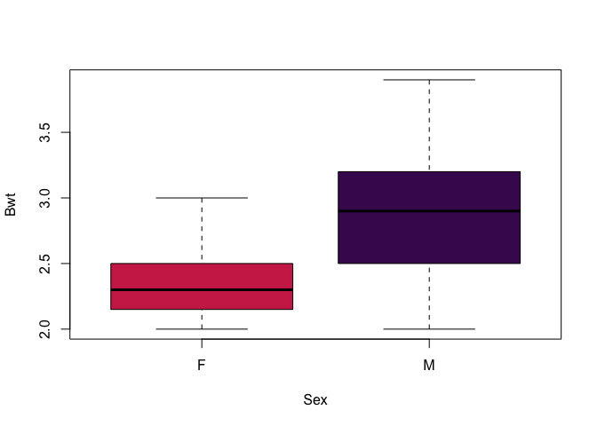
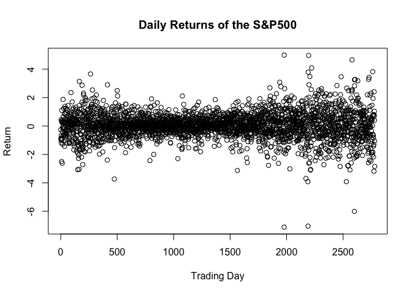
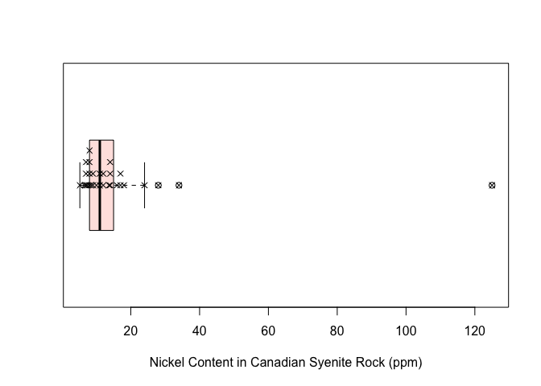
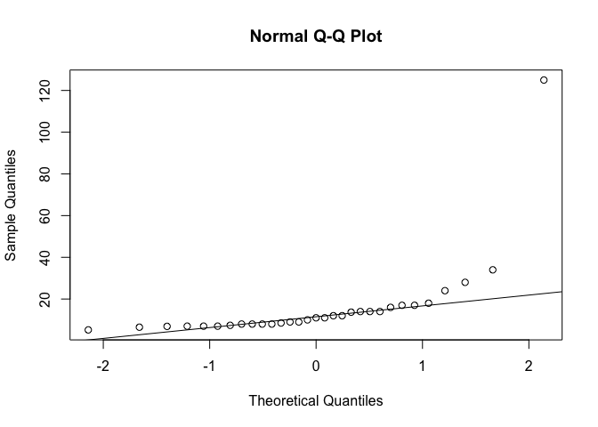
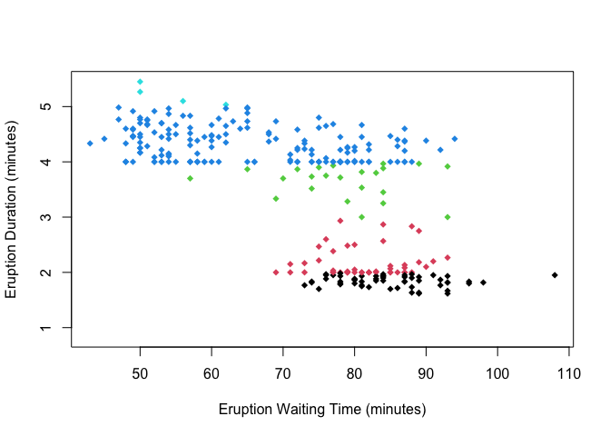
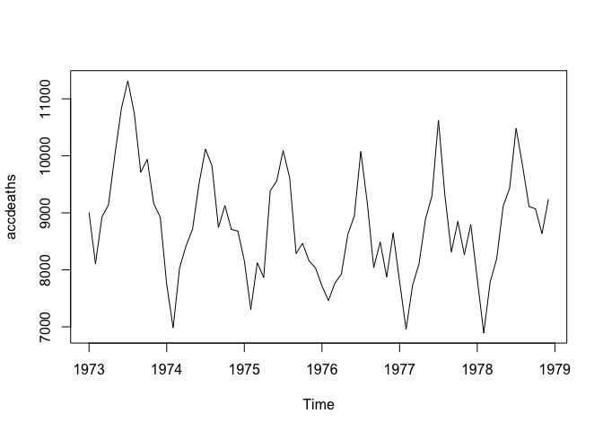
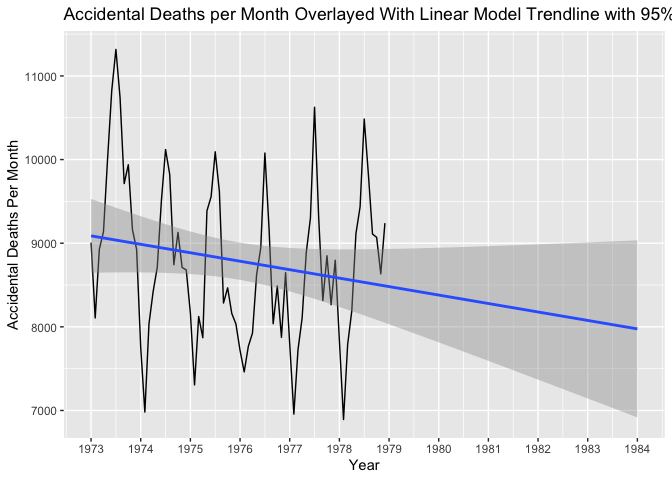
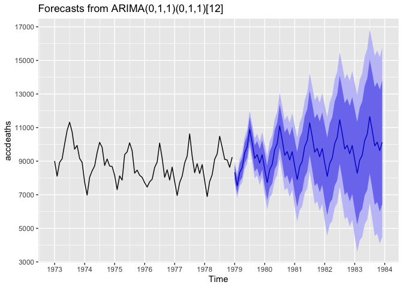

### Functions for Computing Prediction Intervals

```r
#Functions written by Julie Sherman
pi_norm <- function(x, conf.level = 0.95, alternative = "two.sided") {
  alpha <- 1 - conf.level
  n <- length(x)
  xbar <- mean(x)
  err <- sd(x) * sqrt(1 + 1 / n)
  crit <- switch(alternative,
                 "two.sided" = qt(alpha / 2, df = n - 1, lower.tail = FALSE),
                 "less" = -qt(alpha, df = n - 1, lower.tail = FALSE),
                 "greater" = qt(alpha, df = n - 1, lower.tail = FALSE),
                 # Below is the "default" switch, triggered if none of the above
                 stop("alternative must be one of two.sided, less, greater"))
  interval <- switch(alternative,
                     "two.sided" = c(xbar - crit * err, xbar + crit * err),
                     "less" = c(xbar + crit * err, Inf),
                     "greater" = c(-Inf, xbar + crit * err),
                     stop("How did I get here?"))
  attr(interval, "conf.level") <- conf.level
  interval
}


no_param_pi <- function(x, conf.level = 0.95) {
  n <- length(x)
  x <- sort(x)
  j <- max(floor((n + 1) * (1 - conf.level) / 2), 1)
  conf.level <- (n + 1 - 2 * j)/(n + 1)
  interval <- c(x[j], x[n + 1 - j])
  attr(interval, "conf.level") <- conf.level
  interval
}


repint <- function(x, m = length(x), conf.level = 0.95,
                   alternative = "two.sided") {
  alpha <- 1 - conf.level
  n <- length(x)
  xbar <- mean(x)
  err <- sd(x) * sqrt(1 / m + 1 / n)
  crit <- switch(alternative,
                 "two.sided" = qt(alpha / 2, df = n - 1, lower.tail = FALSE),
                 "less" = -qt(alpha, df = n - 1, lower.tail = FALSE),
                 "greater" = qt(alpha, df = n - 1, lower.tail = FALSE),
                 # Below is the "default" switch, triggered if none of the above
                 stop("alternative must be one of two.sided, less, greater"))
  interval <- switch(alternative,
                     "two.sided" = c(xbar - crit * err, xbar + crit * err),
                     "less" = c(xbar + crit * err, Inf),
                     "greater" = c(-Inf, xbar + crit * err),
                     stop("How did I get here?"))
  attr(interval, "conf.level") <- conf.level
  interval
}
```

# Problem 1

*The `cats` data set (**MASS**) contains the heart and body weight of a sample
of male and female cats. Use the data set to estimate a 95% prediction interval
for the body weight of a male cat. Assume that the body weight of cats is
Normally distributed.*

#### Solution

First, lets look at a boxplot of cat weights by sex, just to get an idea of the data we are working with.


```r
boxplot(Bwt~Sex, data = cats, col = c("#ce2d54", "#44135c"))
```


</br>
Here we see that the weight of male cats is roughly centered around 2.8 or so, and that the values range from roughly 2 to 3.8.
</br>

Now we can set up the prediction interval to predict the weight of a "new" male cat.

```r
maleCatBwt = subset(cats, subset = Sex == 'M')$Bwt

pi_norm(maleCatBwt)
```

```
## [1] 1.96728 3.83272
## attr(,"conf.level")
## [1] 0.95
```

Our 95% prediction interval for the weight of a male cat is $(1.96728, 3.83272)$.
</br>

# Problem 2

*The data set `SP500` (**MASS**) contains the returns of the S&P 500 stock index
for the 1990s; that is, it's the ratio of the change of the index's price
divided by the preceding day price. In principle, when predicting the direction
of the stock market with the intention of buying stock, we are willing to be
wrong in one direction but not another; we are okay with predicting the market
grows too little and be pleasantly surprised than to predict the market grows
more than it actually does. So compute a 99% lower prediction bound, assuming
that stock returns are Normally distributed. (You should not trust this number.
First the Normality assumption, despite being assumed a lot in finance, is not
true. Second, stock returns are* not *an independent and identically distributed
sample.)*

#### Solution


```r
plot(SP500, ylab = "Return", xlab = "Trading Day", main = "Daily Returns of the S&P500")
```



```r
pi_norm(SP500, conf.level = .99, alternative = "less")
```

```
## [1] -2.160704       Inf
## attr(,"conf.level")
## [1] 0.99
```
Our 99% lower prediction bound is a -2.16 return.

</br>


# Problem 3

*The data set `abbey` (**MASS**) contains determinations of nickel content (ppm)
in a Canadian syenite rock. The assumption of a Normal distribution clearly is
inappropriate for this data set. Construct a 90% prediction interval for the
next measurement from the data set. Use a nonparametric procedure.*

#### Solution


```r
boxplot(abbey, horizontal = TRUE, xlab = "Nickel Content in Canadian Syenite Rock (ppm)", col = "mistyrose")
stripchart(abbey, method = "stack", offset = 3/4, vertical = FALSE, add = TRUE, pch = 4)
```


</br>

This boxplot with the data points overlayed gives us an overview of how the data looks. It appears to be skewed right, with one extreme outlier at a ppm of more than 120. From the small sample size and skewed distribution, we are unable to assume a normal distribution, but just to drive the point home lets take a look at the qqplot and shapiro test for the data.


```r
qqnorm(abbey)
qqline(abbey)
```



```r
shapiro.test(abbey)
```

```
## 
## 	Shapiro-Wilk normality test
## 
## data:  abbey
## W = 0.41283, p-value = 4.848e-10
```
</br>
Clearly, this data is not normally distributed. So, we are unable to use the standard prediction interval procedure, and will use the nonparametric one instead.
</br>


```r
no_param_pi(abbey, conf.level =  0.90)
```

```
## [1]   5.2 125.0
## attr(,"conf.level")
## [1] 0.9375
```
For our 90% nonparametric prediction interval, we get an interval of $(-20.67, 52.68)$. Due to how wide the nonparametric interval is, we get a negative lower bound, even though it is not possible to have a negative nickel content.
</br>

# Problem 4

*Use the data from Problem 1 to construct a 95% tolerance interval for 99% of
cats' body weight.*

#### Solution


95% Tolerance interval for 99% of *all* cats' bodyweight:

```r
knitr::kable(normtol.int(cats$Bwt, side = 2))
```


| alpha|    P|    x.bar| 2-sided.lower| 2-sided.upper|
|-----:|----:|--------:|-------------:|-------------:|
|  0.05| 0.99| 2.723611|      1.332637|      4.114585|
95% Tolerance interval for 99% of male cats' bodyweight:

```r
maleCatBwt = subset(cats, subset = Sex == 'M')$Bwt
knitr::kable(normtol.int(maleCatBwt, side = 2))
```


| alpha|    P| x.bar| 2-sided.lower| 2-sided.upper|
|-----:|----:|-----:|-------------:|-------------:|
|  0.05| 0.99|   2.9|      1.524437|      4.275563|
</br>

# Problem 5

*The data set `geyser` (**MASS**) contains both wait time between and duration
of eruptions of the Old Faithful geyser in Yellowstone National Park. Use the
data set to construct a nonparametric tolerance interval containing 90% of
geyser eruptions with 99% confidence.*

#### Solution

First, to get an idea of the data (and for fun), lets make a quick plot of the data, looking at eruption duration vs waiting time.


```r
plot(duration~waiting, data = geyser, xlab = "Eruption Waiting Time (minutes)", ylab = "Eruption Duration (minutes)", col = geyser$duration, pch = 18)
```


Interestingly, the data seems to be grouped into ~4.5 minute eruptions, and ~2 minute eruptions. We will expect our tolerance interval to at least mostly encompass *both* groups.
</br>


```r
knitr::kable(nptol.int(geyser$duration, alpha = .01, P = .90, side = 2))
```


| alpha|   P| 2-sided.lower| 2-sided.upper|
|-----:|---:|-------------:|-------------:|
|  0.01| 0.9|      1.716667|      4.966667|
We get a tolerance interval of $(1.717, 4.967)$, which we can see extends from the bottom of the "2 minute group" to the top of the "4.5 minute group".
</br>

# Problem 6

*The data set `accdeaths` (**MASS**) contains a count of accidental deaths in
the United States between 1973 and 1978. What was the mean count of accidental
deaths per month? Use this data set to construct a statistical interval for the
mean number of accidental deaths over the next five years. (Bonus points if you
can compare your interval to the observed mean over those years and assess how
well it did.)*

#### Solution


```r
plot(accdeaths)
```



```r
mean(accdeaths)
```

```
## [1] 8788.792
```
</br>

When plotting the data, we get this graph showing somewhat regular cycles for the monthly number of accidental deaths. The peak always falls sometime in the middle of the year, possibly due to people generally being more active/more "out and about" during the summer time. The mean monthly accidents per month in this data is 8789.

##### Replication Interval


```r
repint(accdeaths, m = 5)
```

```
## [1] 7905.589 9671.994
## attr(,"conf.level")
## [1] 0.95
```
A replication interval at 95% confidence gives us the interval $(7906, 9672)$ for the mean of the next 5 years.

</br>

##### Linear Regression


```r
p1 = autoplot(accdeaths) +
     scale_x_continuous(breaks = seq(1973, 1984, by = 1), lim = c(1973, 1984)) + 
     geom_smooth(method = lm, se = TRUE, fullrange = TRUE) +
   ggtitle("Accidental Deaths per Month Overlayed With Linear Model Trendline with 95% CI") +
   xlab("Year") + ylab("Accidental Deaths Per Month")
   #shows 95% CI

p1
```


This plot is generated by fitting a linear model to the data, and extending that trendline into the future, along with 95% confidence bounds (indicated by the shaded area). We can see that the 95% confidence interval widens significantly by the time it reaches the end of 1983. At this point, the interval for accidental deaths per month is roughly $(6900, 9050)$.

</br>


##### Attempting to use time series stuff


```r
fit = auto.arima(accdeaths)
prediction = predict(fit, n.ahead = 5*12)
mean(prediction$pred)
```

```
## [1] 9535.781
```
If we simply create an ARIMA prediction model for 5 years ahead, then take the mean of all of the monthly prediction values, we get a point estimate of 9536 deaths per month for the years 1979-1983.
However, if we want to be more precise than this point estimate, we can use the forecast function from the forecast library.
</br>


```r
forecast = forecast(fit, h=60)
p2 = autoplot(forecast) +
   scale_x_continuous(breaks = seq(1973, 1984, by = 1)) +
   scale_y_continuous(breaks = seq(3000, 17000, by = 2000))
   ylab("Monthly Accidental Deaths")
```

```
## $y
## [1] "Monthly Accidental Deaths"
## 
## attr(,"class")
## [1] "labels"
```

```r
p2
```


Now, by utilizing time series forecasting tools, we get a prediction that is much more descriptive than just a linear model. In the above chart, we see the prediction time series extending from the original data, along with 80% and 95% confidence intervals. By the end of 1983, the 80% interval is roughly $(6000, 1370)$, and the 95% interval is $(4500, 15500)$, with the central prediction forecast line right around 10000.

</br>

##### Summary
For our original data ranging from 1973-1978, the mean monthly deaths was 8789.
Using a linear model and extending the trendline out to 1983, the 95% confidence interval for monthly deaths at the end of 1983 (the point at which the confidence interval is the widest) is roughly $(6900,9050)$.
Creating an ARIMA model for 1979-1983 and taking the average of the predicted monthly values, we get a point estimate of 9536.
Using a 5 year time series forecast based on the ARIMA model, we get a point estimate of 10000 and 95% confidence interval of $(4500, 15500)$

</br>

I was able to find one data source for accidental deaths after 1978 (https://www.cdc.gov/nchs/data/vsus/mort79_2a.pdf), but the data is extremely uncondensed and I'm not sure how I would go about sifting through it. Other than that source, I was unable to find any other stats on the matter. 


