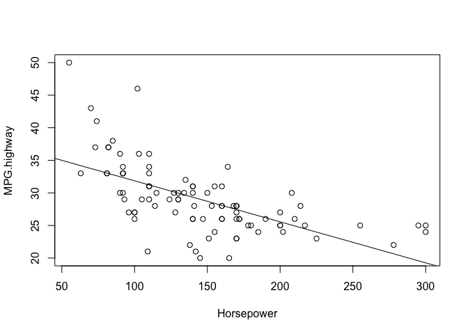
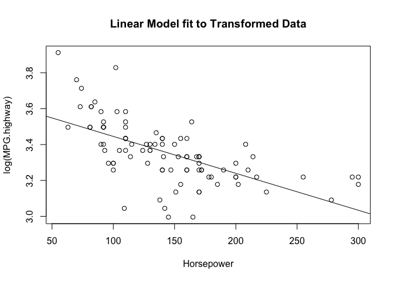

# Problem 1 (Verzani problem 11.1)

*For the `Cars93` (**MASS**) data set, answer the following:*

1. *For `MPG.highway` modeled by `Horsepower`, find the simple regression
   coefficients. What is the predicted mileage for a car with 225 horsepower?*
   
#### Solution


```r
carModel = lm(MPG.highway~Horsepower, data = Cars93)

plot(MPG.highway~Horsepower, data = Cars93)
abline(carModel)
```



```r
summary(carModel)
```

```
## 
## Call:
## lm(formula = MPG.highway ~ Horsepower, data = Cars93)
## 
## Residuals:
##      Min       1Q   Median       3Q      Max 
## -10.2808  -2.2178  -0.1763   1.6727  15.3161 
## 
## Coefficients:
##              Estimate Std. Error t value Pr(>|t|)    
## (Intercept) 38.149884   1.282045  29.757  < 2e-16 ***
## Horsepower  -0.063019   0.008381  -7.519 3.74e-11 ***
## ---
## Signif. codes:  0 '***' 0.001 '**' 0.01 '*' 0.05 '.' 0.1 ' ' 1
## 
## Residual standard error: 4.21 on 91 degrees of freedom
## Multiple R-squared:  0.3832,	Adjusted R-squared:  0.3764 
## F-statistic: 56.54 on 1 and 91 DF,  p-value: 3.744e-11
```
</br>
Predicted Mileage for a car with 225 horsepower:

```r
predict(carModel, data.frame(Horsepower = 225))
```

```
##        1 
## 23.97066
```
</br>
Using this model, the prediction for highway MPG of a car with 225 horsepower is 23.97.
The data appears to have somewhat of an exponential distribution. We can possibly get a better model by applying a log transformation on the data and creating a new linear model based on that.


```r
plot(log(MPG.highway)~Horsepower, data = Cars93)
carModelTranform = lm(log(MPG.highway)~Horsepower, data = Cars93)
abline(carModelTranform)
```



```r
summary(carModelTranform)
```

```
## 
## Call:
## lm(formula = log(MPG.highway) ~ Horsepower, data = Cars93)
## 
## Residuals:
##      Min       1Q   Median       3Q      Max 
## -0.38217 -0.06358  0.00935  0.07113  0.38753 
## 
## Coefficients:
##               Estimate Std. Error t value Pr(>|t|)    
## (Intercept)  3.6511387  0.0413923   88.21  < 2e-16 ***
## Horsepower  -0.0020591  0.0002706   -7.61 2.44e-11 ***
## ---
## Signif. codes:  0 '***' 0.001 '**' 0.01 '*' 0.05 '.' 0.1 ' ' 1
## 
## Residual standard error: 0.1359 on 91 degrees of freedom
## Multiple R-squared:  0.3889,	Adjusted R-squared:  0.3822 
## F-statistic: 57.91 on 1 and 91 DF,  p-value: 2.442e-11
```


2. *Fit the linear model with `MPG.highway` modeled by `Weight`. Find the
   predicted highway mileage of a 6,400 pound HUMMER H2 and a 2,524 pound MINI
   Cooper.*


```r
# Your code here
```

3. *Fit the linear model `Max.Price` modeled by `Min.Price`. Why might you
   expect the slope to be around 1?*


```r
# Your code here
```

**BONUS**: *Can you think of any other linear relationships among the
variables?*


```r
# Your code here
```

# Problem 2 (Verzani problem 11.2)

*For the data set `MLBattend` (**UsingR**) concerning Major League Baseball
attendance, fit a linear model of `attendance` modeled by `wins`. What is the
predicted increase in attendance if a team that won 80 games last year wins 90
this year?*


```r
# Your code here
```

# Problem 3 (Verzani problem 11.3)

*People often predict children's future height by using their 2-year-old height.
A common rule is to double the height. The table contains data for eight
people's heights as 2-year-olds and as adults. Using the data, what is the
predicted adult height for a 2-year-old who is 33 inches tall?*

Group       |    |    |    |    |    |    |    |    |
------------|----|----|----|----|----|----|----|----|
Age 2 (in.) | 39 | 30 | 32 | 34 | 35 | 36 | 36 | 30 |
Adult (in.) | 71 | 63 | 63 | 67 | 68 | 68 | 70 | 64 |


```r
# Your code here
```

# Problem 4 (Verzani problem 11.4)

*The `galton` (**UsingR**) data set contains data collected by Francis Galton in
1885 concerning the influence a parent's height has on a child's height. Fit a
linear model for a child's height modeled by his parent's height. Make a
scatterplot with a regression line. (Is this data set a good candidate for using
`jitter()`?) What is the value of $\hat{\beta}_1$, and why is this of interest?*


```r
# Your code here
```

# Problem 5 (Verzani problem 11.5)

*The formulas*

$$\hat{\beta}_1 = \frac{\sum_{i = 1}^n (x_i - \bar{x})(y_i - \bar{y})}{\sum_{i =
1}^n (x_i - \bar{x})^2},$$

$$\hat{\beta}_0 = \bar{y} - \hat{\beta}_1 \bar{x},$$

*and the prediction line equation can be rewritten in terms of the correlation
coefficient, $r$, as*

$$\frac{\hat{y}_i - \bar{y}}{s_y} = r \frac{x_i - \bar{x}}{s_x}.$$

*Thus the five summary numbers: the two means, the standard deviations, and the
correlation coefficient are fundamental for regression analysis.*

*This is interpreted as follows. Scaled differences of $\hat{y}_i$ from the mean
$\bar{y}$ are less than the scaled differences of $x_i$ from $\bar{x}$, as
$\left|r\right| \le 1$. That is, "regression" toward the mean, as unusually
large differences from the mean are lessened in their prediction for $y$.*

*For the data set `galton` (**UsingR**) use `scale()` on the variables `parent`
and `child`, and then model the height of the child by the height of the parent.
What are the estimates for $r$ and $\beta_1$.*


```r
# Your code here
```

