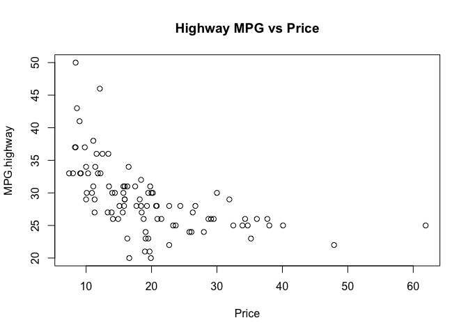
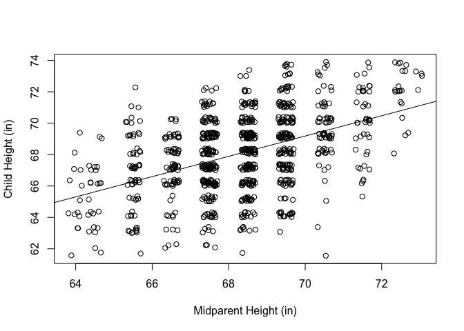

# Problem 1 (Verzani problem 11.1)

*For the `Cars93` (**MASS**) data set, answer the following:*

1. *For `MPG.highway` modeled by `Horsepower`, find the simple regression
   coefficients. What is the predicted mileage for a car with 225 horsepower?*
   
#### Solution


```r
carModel = lm(MPG.highway~Horsepower, data = Cars93)

plot(MPG.highway~Horsepower, data = Cars93)
abline(carModel)
```


```r
summary(carModel)
```

```
## 
## Call:
## lm(formula = MPG.highway ~ Horsepower, data = Cars93)
## 
## Residuals:
##      Min       1Q   Median       3Q      Max 
## -10.2808  -2.2178  -0.1763   1.6727  15.3161 
## 
## Coefficients:
##              Estimate Std. Error t value Pr(>|t|)    
## (Intercept) 38.149884   1.282045  29.757  < 2e-16 ***
## Horsepower  -0.063019   0.008381  -7.519 3.74e-11 ***
## ---
## Signif. codes:  0 '***' 0.001 '**' 0.01 '*' 0.05 '.' 0.1 ' ' 1
## 
## Residual standard error: 4.21 on 91 degrees of freedom
## Multiple R-squared:  0.3832,	Adjusted R-squared:  0.3764 
## F-statistic: 56.54 on 1 and 91 DF,  p-value: 3.744e-11
```
</br>
Predicted Mileage for a car with 225 horsepower:

```r
predict(carModel, data.frame(Horsepower = 225))
```

```
##        1 
## 23.97066
```
</br>
Using this model, the prediction for highway MPG of a car with 225 horsepower is 23.97.
The data appears to have somewhat of an exponential distribution. We can possibly get a better model by applying a log transformation on the data and creating a new linear model based on that.


```r
plot(log(MPG.highway)~Horsepower, data = Cars93, main = "Linear Model fit to Transformed Data")
carModelTranform = lm(log(MPG.highway)~Horsepower, data = Cars93)
abline(carModelTranform)
```


```r
summary(carModelTranform)
```

```
## 
## Call:
## lm(formula = log(MPG.highway) ~ Horsepower, data = Cars93)
## 
## Residuals:
##      Min       1Q   Median       3Q      Max 
## -0.38217 -0.06358  0.00935  0.07113  0.38753 
## 
## Coefficients:
##               Estimate Std. Error t value Pr(>|t|)    
## (Intercept)  3.6511387  0.0413923   88.21  < 2e-16 ***
## Horsepower  -0.0020591  0.0002706   -7.61 2.44e-11 ***
## ---
## Signif. codes:  0 '***' 0.001 '**' 0.01 '*' 0.05 '.' 0.1 ' ' 1
## 
## Residual standard error: 0.1359 on 91 degrees of freedom
## Multiple R-squared:  0.3889,	Adjusted R-squared:  0.3822 
## F-statistic: 57.91 on 1 and 91 DF,  p-value: 2.442e-11
```
Though the p-values for the transformed model are a bit better, the $R^2$ values are about the same, so this model may not have much of an advantage over the original.

```r
exp(predict(carModelTranform, data.frame(Horsepower = 225)))
```

```
##        1 
## 24.23593
```
Using this transformed model, we predict a MPG of 24.2 for a car with 225 horsepower. Clearly, not a very substantial difference between this value and the previous one.
</br>


2. *Fit the linear model with `MPG.highway` modeled by `Weight`. Find the
   predicted highway mileage of a 6,400 pound HUMMER H2 and a 2,524 pound MINI
   Cooper.*


```r
plot(MPG.highway~Weight, data = Cars93)
weightModel = lm(MPG.highway~Weight, data = Cars93)
abline(weightModel)
```


Predict Highway MPG of a 6,400lbs Hummer H2:

```r
predict(weightModel, data.frame(Weight = 6400))
```

```
##        1 
## 4.708186
```

Predict Highway MPG of a 2524lbs Mini Cooper:

```r
predict(weightModel, data.frame(Weight = 2524))
```

```
##        1 
## 33.10787
```


3. *Fit the linear model `Max.Price` modeled by `Min.Price`. Why might you
   expect the slope to be around 1?*

#### Solution


```r
priceModel = lm(Max.Price~Min.Price, data = Cars93)
plot(Max.Price~Min.Price, data = Cars93)
abline(priceModel)
```


When modeling max price vs min price, we expect the slope to be around 1 because we can predict that a slight increase in the max price of a car will lead to a near-equal increase in the min price of that car.

**BONUS**: *Can you think of any other linear relationships among the
variables?*


```r
head(Cars93)
```

```
##   Manufacturer   Model    Type Min.Price Price Max.Price MPG.city MPG.highway
## 1        Acura Integra   Small      12.9  15.9      18.8       25          31
## 2        Acura  Legend Midsize      29.2  33.9      38.7       18          25
## 3         Audi      90 Compact      25.9  29.1      32.3       20          26
## 4         Audi     100 Midsize      30.8  37.7      44.6       19          26
## 5          BMW    535i Midsize      23.7  30.0      36.2       22          30
## 6        Buick Century Midsize      14.2  15.7      17.3       22          31
##              AirBags DriveTrain Cylinders EngineSize Horsepower  RPM
## 1               None      Front         4        1.8        140 6300
## 2 Driver & Passenger      Front         6        3.2        200 5500
## 3        Driver only      Front         6        2.8        172 5500
## 4 Driver & Passenger      Front         6        2.8        172 5500
## 5        Driver only       Rear         4        3.5        208 5700
## 6        Driver only      Front         4        2.2        110 5200
##   Rev.per.mile Man.trans.avail Fuel.tank.capacity Passengers Length Wheelbase
## 1         2890             Yes               13.2          5    177       102
## 2         2335             Yes               18.0          5    195       115
## 3         2280             Yes               16.9          5    180       102
## 4         2535             Yes               21.1          6    193       106
## 5         2545             Yes               21.1          4    186       109
## 6         2565              No               16.4          6    189       105
##   Width Turn.circle Rear.seat.room Luggage.room Weight  Origin          Make
## 1    68          37           26.5           11   2705 non-USA Acura Integra
## 2    71          38           30.0           15   3560 non-USA  Acura Legend
## 3    67          37           28.0           14   3375 non-USA       Audi 90
## 4    70          37           31.0           17   3405 non-USA      Audi 100
## 5    69          39           27.0           13   3640 non-USA      BMW 535i
## 6    69          41           28.0           16   2880     USA Buick Century
```
Looking at turn radius vs wheelbase

```r
plot(Turn.circle~Wheelbase, data = Cars93, main = "Turn Radius vs Wheelbase")
```


Looking at MPG vs price

```r
plot(MPG.highway~Price, data = Cars93, main = "Highway MPG vs Price")
```


</br>
This is a bit surprising to me, as I was expecting an increase in price to correspond with an increase in MPG (higher price = more high tech = better mpg). However, clearly this is not the case, perhaps because more expensive cars cater more to 'car aficionados' who are less concerned with the MPG their cars get, and more with performance.

Looking at engine size vs horsepower

```r
plot(Horsepower~EngineSize, data = Cars93, main = "Horsepower vs Engine Size")
```


</br>

# Problem 2 (Verzani problem 11.2)

*For the data set `MLBattend` (**UsingR**) concerning Major League Baseball
attendance, fit a linear model of `attendance` modeled by `wins`. What is the
predicted increase in attendance if a team that won 80 games last year wins 90
this year?*

#### Solution

```r
baseballModel = lm(attendance~wins, data = MLBattend)
summary(baseballModel)
```

```
## 
## Call:
## lm(formula = attendance ~ wins, data = MLBattend)
## 
## Residuals:
##      Min       1Q   Median       3Q      Max 
## -1540392  -448992   -98622   381084  3029386 
## 
## Coefficients:
##             Estimate Std. Error t value Pr(>|t|)    
## (Intercept)  -378164     146401  -2.583  0.00996 ** 
## wins           27345       1833  14.917  < 2e-16 ***
## ---
## Signif. codes:  0 '***' 0.001 '**' 0.01 '*' 0.05 '.' 0.1 ' ' 1
## 
## Residual standard error: 672100 on 836 degrees of freedom
## Multiple R-squared:  0.2102,	Adjusted R-squared:  0.2093 
## F-statistic: 222.5 on 1 and 836 DF,  p-value: < 2.2e-16
```

```r
plot(attendance~wins, data = MLBattend)
abline(baseballModel)
```


Predicted increase in attendance if a team that won 80 games last year wins 90 this year?

```r
prediction80Wins = predict(baseballModel, data.frame(wins = c(80)))
prediction80Wins
```

```
##       1 
## 1809451
```

```r
prediction90Wins = predict(baseballModel, data.frame(wins = c(90)))
prediction90Wins
```

```
##       1 
## 2082903
```

```r
#Increase in attendance:
prediction90Wins - prediction80Wins
```

```
##        1 
## 273451.8
```
We predict 1,809,451 people to attend the game of a team with 80 wins, and 2,082,903 people to attend the game of a team with 90 wins, which is an increase of roughly 273,452 people.
</br>


```r
baseballModel = lm(attendance~losses, data = MLBattend)
summary(baseballModel)
```

```
## 
## Call:
## lm(formula = attendance ~ losses, data = MLBattend)
## 
## Residuals:
##      Min       1Q   Median       3Q      Max 
## -1650710  -517581   -74581   448093  2993029 
## 
## Coefficients:
##             Estimate Std. Error t value Pr(>|t|)    
## (Intercept)  3185235     157583  20.213   <2e-16 ***
## losses        -17841       1973  -9.044   <2e-16 ***
## ---
## Signif. codes:  0 '***' 0.001 '**' 0.01 '*' 0.05 '.' 0.1 ' ' 1
## 
## Residual standard error: 721800 on 836 degrees of freedom
## Multiple R-squared:  0.08912,	Adjusted R-squared:  0.08803 
## F-statistic:  81.8 on 1 and 836 DF,  p-value: < 2.2e-16
```

```r
plot(attendance~losses, data = MLBattend)
abline(baseballModel)
```


While we saw a positive correlation between game attendance and wins, there is a negative correlation between game attendance and losses, although the slope of the linear model is less steep and the $R^2$ value is smaller compared to attendance vs wins.
</br>

# Problem 3 (Verzani problem 11.3)

*People often predict children's future height by using their 2-year-old height.
A common rule is to double the height. The table contains data for eight
people's heights as 2-year-olds and as adults. Using the data, what is the
predicted adult height for a 2-year-old who is 33 inches tall?*

Group       |    |    |    |    |    |    |    |    |
------------|----|----|----|----|----|----|----|----|
Age 2 (in.) | 39 | 30 | 32 | 34 | 35 | 36 | 36 | 30 |
Adult (in.) | 71 | 63 | 63 | 67 | 68 | 68 | 70 | 64 |


```r
heights = data.frame(baby = c(39,30,32,34,35,36,36,30),
                     adult = c(71,63,63,67,68,68,70,64))

heightModel = lm(adult~baby, data = heights)
summary(heightModel)
```

```
## 
## Call:
## lm(formula = adult ~ baby, data = heights)
## 
## Residuals:
##     Min      1Q  Median      3Q     Max 
## -1.8929 -0.4464  0.1071  0.4821  1.3929 
## 
## Coefficients:
##             Estimate Std. Error t value Pr(>|t|)    
## (Intercept)  35.1786     4.4507   7.904 0.000218 ***
## baby          0.9286     0.1304   7.120 0.000386 ***
## ---
## Signif. codes:  0 '***' 0.001 '**' 0.01 '*' 0.05 '.' 0.1 ' ' 1
## 
## Residual standard error: 1.091 on 6 degrees of freedom
## Multiple R-squared:  0.8942,	Adjusted R-squared:  0.8765 
## F-statistic:  50.7 on 1 and 6 DF,  p-value: 0.000386
```

```r
plot(adult~baby, data = heights, xlab = "Height When 2 Years Old (in)", ylab = "Hight When Adult (in)")
abline(heightModel)
```


```r
predict(heightModel, data.frame(baby = 33))
```

```
##        1 
## 65.82143
```
The predicted adult height of a 33 inch tall baby is 65.8 inches.
</br>

# Problem 4 (Verzani problem 11.4)

*The `galton` (**UsingR**) data set contains data collected by Francis Galton in
1885 concerning the influence a parent's height has on a child's height. Fit a
linear model for a child's height modeled by his parent's height. Make a
scatterplot with a regression line. (Is this data set a good candidate for using
`jitter()`?) What is the value of $\hat{\beta}_1$, and why is this of interest?*


```r
galtonModel = lm(child~parent, data = galton)
summary(galtonModel)
```

```
## 
## Call:
## lm(formula = child ~ parent, data = galton)
## 
## Residuals:
##     Min      1Q  Median      3Q     Max 
## -7.8050 -1.3661  0.0487  1.6339  5.9264 
## 
## Coefficients:
##             Estimate Std. Error t value Pr(>|t|)    
## (Intercept) 23.94153    2.81088   8.517   <2e-16 ***
## parent       0.64629    0.04114  15.711   <2e-16 ***
## ---
## Signif. codes:  0 '***' 0.001 '**' 0.01 '*' 0.05 '.' 0.1 ' ' 1
## 
## Residual standard error: 2.239 on 926 degrees of freedom
## Multiple R-squared:  0.2105,	Adjusted R-squared:  0.2096 
## F-statistic: 246.8 on 1 and 926 DF,  p-value: < 2.2e-16
```

```r
plot(jitter(child, 2)~jitter(parent, 2), data = galton, xlab = "Midparent Height (in)", ylab = "Child Height (in)")
abline(galtonModel)
```


The value of $\hat{\beta}_1$ is 0.64629. This is interesting because in a "perfect world" we might expect this value to be 1, meaning the height of the child would match the height of the parents. However, because $\hat{\beta}_1$ is less than 1, the expected height of a child with, for example, midparent height of 70 inches will actually be less than 70 inches.
</br>

# Problem 5 (Verzani problem 11.5)

*The formulas*

$$\hat{\beta}_1 = \frac{\sum_{i = 1}^n (x_i - \bar{x})(y_i - \bar{y})}{\sum_{i =
1}^n (x_i - \bar{x})^2},$$

$$\hat{\beta}_0 = \bar{y} - \hat{\beta}_1 \bar{x},$$

*and the prediction line equation can be rewritten in terms of the correlation
coefficient, $r$, as*

$$\frac{\hat{y}_i - \bar{y}}{s_y} = r \frac{x_i - \bar{x}}{s_x}.$$

*Thus the five summary numbers: the two means, the standard deviations, and the
correlation coefficient are fundamental for regression analysis.*

*This is interpreted as follows. Scaled differences of $\hat{y}_i$ from the mean
$\bar{y}$ are less than the scaled differences of $x_i$ from $\bar{x}$, as
$\left|r\right| \le 1$. That is, "regression" toward the mean, as unusually
large differences from the mean are lessened in their prediction for $y$.*

*For the data set `galton` (**UsingR**) use `scale()` on the variables `parent`
and `child`, and then model the height of the child by the height of the parent.
What are the estimates for $r$ and $\beta_1$.*


```r
scaledModel = lm(scale(child)~scale(parent), data = galton)
summary(scaledModel)
```

```
## 
## Call:
## lm(formula = scale(child) ~ scale(parent), data = galton)
## 
## Residuals:
##      Min       1Q   Median       3Q      Max 
## -3.09976 -0.54256  0.01934  0.64889  2.35368 
## 
## Coefficients:
##                 Estimate Std. Error t value Pr(>|t|)    
## (Intercept)   -7.835e-16  2.918e-02    0.00        1    
## scale(parent)  4.588e-01  2.920e-02   15.71   <2e-16 ***
## ---
## Signif. codes:  0 '***' 0.001 '**' 0.01 '*' 0.05 '.' 0.1 ' ' 1
## 
## Residual standard error: 0.889 on 926 degrees of freedom
## Multiple R-squared:  0.2105,	Adjusted R-squared:  0.2096 
## F-statistic: 246.8 on 1 and 926 DF,  p-value: < 2.2e-16
```

```r
plot(scale(child)~scale(parent), data = galton)
```


Estimate for $r$: 0.4588 </br>
Estimate for $\beta_1$: 0.4588

