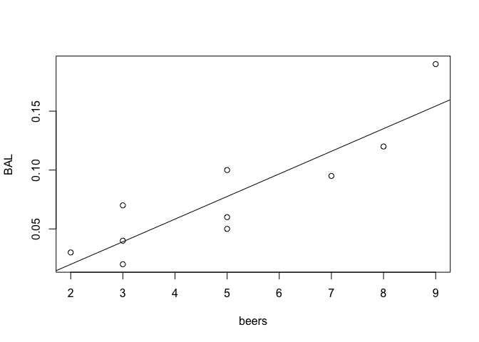

# Problem 1 (Verzani problem 10.7)

*The more beer you drink, the more your blood alcohol level (BAL) rises. The
table below contains a data sete on beer consumption. Make a scatterplot with a
regression line and 95% prediction intervals drawn. Test the hypothesis that one
beer raises your BAL by 0.02% against the alternative that it raises it less.*

| beers |   5  |   2  |   9  |   8  |   3  |   7   |   3  |   5  |   3  |   5  |
|-------|------|------|------|------|------|-------|------|------|------|------|
| BAL   | 0.10 | 0.03 | 0.19 | 0.12 | 0.04 | 0.095 | 0.07 | 0.06 | 0.02 | 0.05 |

```r
#Functions by Julie Sherman

predict_func <- function(fit) {
  response <- names(fit$model)[[1]]
  explanatory <- names(fit$model)[[2]]
  function(x, ...) {
    dat <- data.frame(x)
    names(dat) <- explanatory
    predict(fit, dat, ...)
  }
}


plot_fit <- function(fit, interval = "confidence", level = 0.95, len = 1000,
                     ...) {
  fit_func <- predict_func(fit)
  x_range <- c(min(fit$model[[2]]), max(fit$model[[2]]))
  x_vals <- seq(from = x_range[[1]] * 0.9, to = x_range[[2]] * 1.1,
                length = len)
  interval_mat <- fit_func(x_vals, interval = interval, level = level)
  y_range <- c(min(c(interval_mat[, 2], fit$model[[1]])),
               max(c(interval_mat[, 3], fit$model[[1]])))
  plot(fit$model[2:1], xlim = x_range, ylim = y_range, ...)
  abline(fit)
  lines(x_vals, interval_mat[, 2], col = "red")
  lines(x_vals, interval_mat[, 3], col = "red")
}
```


```r
df <- data.frame(beers = c(5,2,9,8,3,7,3,5,3,5), BAL = c(0.1, 0.03, 0.19, 0.12, 0.04, 0.095, 0.07, 0.06, 0.02, 0.05))
model <- lm(BAL~beers, data = df)

plot(df)
abline(model)
```

<!-- -->

```r
plot_fit(model)
```

<!-- -->

# Problem 2 (Verzani problem 10.11)

*For the `homedata` (**UsingR**) data set, find the regression equation to
predict the year-2000 value of a home from its year-1970 value. Make a
prediction for an \$80,000 home in 1970. Comment on the appropriateness of the
regression model by investigating the residuals.*


```r
# Your code here
```

# Problem 3 (Verzani problem 10.13)

*The `alaska.pipeline` (**UsingR**) data set contains measurements of defects on
the Alaska pipeline that are taken first in the field and then in the
laboratory. The measurements are done in six batches. Fit a linear model for the
lab-defect size as modeled by the field-defect size. Find the coefficients.
Discuss the appropriateness of the model.*


```r
# Your code here
```

# Problem 4 (Verzani problem 10.15)

*The `galton` (**UsingR**) data set contains data collected by Francis Galton in
1885 concerning the influence a parent's height has on a child's height. Fit a
linear model modeling a child's height by his parents'. Do a test of
significance to see whether $\beta_1$ equals 1 against a two-sided alternative.*


```r
# Your code here
```

# Problem 5 (Verzani problem 10.17)

*The `alaska.pipeline` (**UsingR**) data set appears appropriate for a linear
model, but the assumption of equal variances does not seem appropriate. A
log-transformation of each variable does seem to have equal variances. Fit the
model*

$$\log(\texttt{lab.defect}) = \beta_0 + \beta_1 \log(\texttt{field.defect}) +
\epsilon.$$

*Investigate the residuals and determine whether the assumption of equal
variance seems appropriate.*


```r
# Your code here
```

# Problem 6 (Verzani problem 10.19)

*In a simple linear regression, confidence intervals for $\beta_0$ and $\beta_1$
are given separately in terms of the $t$-distribution as $\hat{\beta}_i \pm t^*
\text{SE}(\hat{\beta}_i)$. They can also be found* jointly, *giving a
**confidence ellipse** for the parameters as a pair. This can be found easily in
R with the **ellipse** package. If `res` is the result of the `lm()` function,
then `plot(ellipse(res), type = "l")` will draw the confidence ellipse.*

*For the `deflection` (**UsingR**) data set, find the confidence ellipse for
`Deflection` modeled by `Load`.*


```r
# Your code here
```
