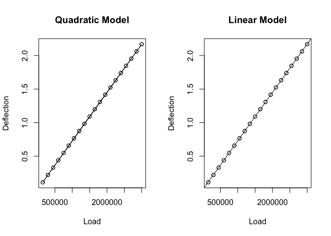

```r
#by julie sherman
predict_func <- function(fit) {
  response <- names(fit$model)[[1]]
  explanatory <- names(fit$model)[[2]]
  function(x, ...) {
    dat <- data.frame(x)
    names(dat) <- explanatory
    predict(fit, dat, ...)
  }
}

min_aic_model <- function(...) {
  models <- list(...)
  aic_list <- sapply(models, AIC)
  best_model <- models[[which.min(aic_list)]]
  best_model
}
```

# Problem 1 (Verzani problem 11.22)

*For the data set `trees`, model the `Volume` by the `Girth` and `Height`
variables. Does the model fit the data well?*


```r
treeModel <- lm(Volume~Girth + Height, data = trees)
summary(treeModel)
```

```
## 
## Call:
## lm(formula = Volume ~ Girth + Height, data = trees)
## 
## Residuals:
##     Min      1Q  Median      3Q     Max 
## -6.4065 -2.6493 -0.2876  2.2003  8.4847 
## 
## Coefficients:
##             Estimate Std. Error t value Pr(>|t|)    
## (Intercept) -57.9877     8.6382  -6.713 2.75e-07 ***
## Girth         4.7082     0.2643  17.816  < 2e-16 ***
## Height        0.3393     0.1302   2.607   0.0145 *  
## ---
## Signif. codes:  0 '***' 0.001 '**' 0.01 '*' 0.05 '.' 0.1 ' ' 1
## 
## Residual standard error: 3.882 on 28 degrees of freedom
## Multiple R-squared:  0.948,	Adjusted R-squared:  0.9442 
## F-statistic:   255 on 2 and 28 DF,  p-value: < 2.2e-16
```
3D Plot of the data for fun

```r
plot3d(Volume~Girth + Height, data = trees)
rglwidget()
```

```{=html}
<div id="rgl79446" style="width:672px;height:480px;" class="rglWebGL html-widget"></div>
<script type="application/json" data-for="rgl79446">{"x":{"material":{"color":"#000000","alpha":1,"lit":true,"ambient":"#000000","specular":"#FFFFFF","emission":"#000000","shininess":50,"smooth":true,"front":"filled","back":"filled","size":3,"lwd":1,"fog":true,"point_antialias":false,"line_antialias":false,"texture":null,"textype":"rgb","texmipmap":false,"texminfilter":"linear","texmagfilter":"linear","texenvmap":false,"depth_mask":true,"depth_test":"less","isTransparent":false,"polygon_offset":[0,0],"margin":"","floating":false,"tag":""},"rootSubscene":1,"objects":{"7":{"id":7,"type":"points","material":{"lit":false},"vertices":"0","colors":"1","centers":"2","ignoreExtent":false,"flags":34816},"9":{"id":9,"type":"text","material":{"lit":false,"margin":0,"floating":true,"edge":[0,1,1]},"vertices":"3","colors":"4","texts":[["Girth"]],"cex":[[1]],"adj":[[0.5,0.5,0.5]],"centers":"5","family":[["sans"]],"font":[[1]],"ignoreExtent":true,"flags":33808},"10":{"id":10,"type":"text","material":{"lit":false,"margin":1,"floating":true,"edge":[1,1,1]},"vertices":"6","colors":"7","texts":[["Height"]],"cex":[[1]],"adj":[[0.5,0.5,0.5]],"centers":"8","family":[["sans"]],"font":[[1]],"ignoreExtent":true,"flags":33808},"11":{"id":11,"type":"text","material":{"lit":false,"margin":2,"floating":true,"edge":[1,1,1]},"vertices":"9","colors":"10","texts":[["Volume"]],"cex":[[1]],"adj":[[0.5,0.5,0.5]],"centers":"11","family":[["sans"]],"font":[[1]],"ignoreExtent":true,"flags":33808},"5":{"id":5,"type":"light","vertices":[[0,0,1]],"colors":[[1,1,1,1],[1,1,1,1],[1,1,1,1]],"viewpoint":true,"finite":false},"4":{"id":4,"type":"background","material":{},"colors":"12","centers":"13","sphere":false,"fogtype":"none","fogscale":1,"flags":32768},"6":{"id":6,"type":"background","material":{"lit":false,"back":"lines"},"colors":"14","centers":"15","sphere":false,"fogtype":"none","fogscale":1,"flags":32768},"8":{"id":8,"type":"bboxdeco","material":{"front":"lines","back":"lines"},"vertices":"16","colors":"17","axes":{"mode":["pretty","pretty","pretty"],"step":[2,5,10],"nticks":[5,5,5],"marklen":[15,15,15],"expand":[1.02999997138977,1.02999997138977,1.02999997138977]},"draw_front":true,"flags":32769},"1":{"id":1,"type":"subscene","par3d":{"antialias":8,"FOV":30,"ignoreExtent":false,"listeners":1,"mouseMode":{"none":"none","left":"trackball","right":"zoom","middle":"fov","wheel":"pull"},"observer":[0,0,176.27880859375],"modelMatrix":[[3.38141345977783,0,0,-48.8614234924316],[0,0.592712163925171,0.585076630115509,-69.9627532958984],[0,-1.62846326828003,0.212950482964516,-63.4287109375],[0,0,0,1]],"projMatrix":[[3.73205089569092,0,0,0],[0,3.73205089569092,0,0],[0,0,-3.86370325088501,-635.464721679688],[0,0,-1,0]],"skipRedraw":false,"userMatrix":[[1,0,0,0],[0,0.342020143325668,0.939692620785909,0],[0,-0.939692620785909,0.342020143325668,0],[0,0,0,1]],"userProjection":[[1,0,0,0],[0,1,0,0],[0,0,1,0],[0,0,0,1]],"scale":[3.38141345977783,1.73297441005707,0.622625529766083],"viewport":{"x":0,"y":0,"width":1,"height":1},"zoom":1,"bbox":[8.30000019073486,20.6000003814697,63,87,10.1999998092651,77],"windowRect":[0,0,256,256],"family":"sans","font":1,"cex":1,"useFreeType":true,"fontname":"NULL","maxClipPlanes":2147483647,"glVersion":"NA","activeSubscene":0},"embeddings":{"viewport":"replace","projection":"replace","model":"replace","mouse":"replace"},"objects":[6,8,7,9,10,11,5],"subscenes":[],"flags":36113}},"crosstalk":{"key":[],"group":[],"id":[],"options":[]},"width":672,"height":480,"context":{"shiny":false,"rmarkdown":"html_document"},"buffer":{"accessors":[{"bufferView":0,"componentType":5126,"count":31,"type":"VEC3"},{"bufferView":1,"componentType":5121,"count":1,"type":"VEC4"},{"bufferView":2,"componentType":5126,"count":31,"type":"VEC3"},{"bufferView":3,"componentType":5126,"count":1,"type":"VEC3"},{"bufferView":4,"componentType":5121,"count":1,"type":"VEC4"},{"bufferView":5,"componentType":5126,"count":1,"type":"VEC3"},{"bufferView":6,"componentType":5126,"count":1,"type":"VEC3"},{"bufferView":7,"componentType":5121,"count":1,"type":"VEC4"},{"bufferView":8,"componentType":5126,"count":1,"type":"VEC3"},{"bufferView":9,"componentType":5126,"count":1,"type":"VEC3"},{"bufferView":10,"componentType":5121,"count":1,"type":"VEC4"},{"bufferView":11,"componentType":5126,"count":1,"type":"VEC3"},{"bufferView":12,"componentType":5126,"count":1,"type":"VEC4"},{"bufferView":13,"componentType":5121,"count":1,"type":"VEC3"},{"bufferView":14,"componentType":5121,"count":1,"type":"VEC4"},{"bufferView":15,"componentType":5121,"count":1,"type":"VEC3"},{"bufferView":16,"componentType":5126,"count":17,"type":"VEC3"},{"bufferView":17,"componentType":5121,"count":1,"type":"VEC4"}],"bufferViews":[{"buffer":0,"byteLength":372,"byteOffset":0},{"buffer":0,"byteLength":4,"byteOffset":372},{"buffer":0,"byteLength":372,"byteOffset":376},{"buffer":0,"byteLength":12,"byteOffset":748},{"buffer":0,"byteLength":4,"byteOffset":760},{"buffer":0,"byteLength":12,"byteOffset":764},{"buffer":0,"byteLength":12,"byteOffset":776},{"buffer":0,"byteLength":4,"byteOffset":788},{"buffer":0,"byteLength":12,"byteOffset":792},{"buffer":0,"byteLength":12,"byteOffset":804},{"buffer":0,"byteLength":4,"byteOffset":816},{"buffer":0,"byteLength":12,"byteOffset":820},{"buffer":0,"byteLength":16,"byteOffset":832},{"buffer":0,"byteLength":3,"byteOffset":848},{"buffer":0,"byteLength":4,"byteOffset":851},{"buffer":0,"byteLength":3,"byteOffset":855},{"buffer":0,"byteLength":204,"byteOffset":860},{"buffer":0,"byteLength":4,"byteOffset":1064}],"buffers":[{"byteLength":1068,"bytes":"zcwEQQAAjELNzCRBmpkJQQAAgkLNzCRBzcwMQQAAfEIzMyNBAAAoQQAAkEIzM4NBMzMrQQAA\nokJmZpZBzcwsQQAApkKamZ1BAAAwQQAAhEKamXlBAAAwQQAAlkKamZFBmpkxQQAAoELNzLRB\nMzMzQQAAlkIzM59Bzcw0QQAAnkKamcFBZmY2QQAAmEIAAKhBZmY2QQAAmEIzM6tBMzM7QQAA\nikJmZqpBAABAQQAAlkLNzJhBZmZOQQAAlEKambFBZmZOQQAAqkIzMwdCzcxUQQAArEIzM9tB\nMzNbQQAAjkKamc1BzcxcQQAAgEIzM8dBAABgQQAAnEIAAApCMzNjQQAAoEKamf1BAABoQQAA\nlEIzMxFCAACAQQAAkEIzMxlCZmaCQQAAmkJmZipCZmaKQQAAokKamV1CAACMQQAApELNzF5C\nMzOPQQAAoEIzM2lCAACQQQAAoEIAAE5CAACQQQAAoEIAAExCzcykQQAArkIAAJpCAAAAAc3M\nBEEAAIxCzcwkQZqZCUEAAIJCzcwkQc3MDEEAAHxCMzMjQQAAKEEAAJBCMzODQTMzK0EAAKJC\nZmaWQc3MLEEAAKZCmpmdQQAAMEEAAIRCmpl5QQAAMEEAAJZCmpmRQZqZMUEAAKBCzcy0QTMz\nM0EAAJZCMzOfQc3MNEEAAJ5CmpnBQWZmNkEAAJhCAACoQWZmNkEAAJhCMzOrQTMzO0EAAIpC\nZmaqQQAAQEEAAJZCzcyYQWZmTkEAAJRCmpmxQWZmTkEAAKpCMzMHQs3MVEEAAKxCMzPbQTMz\nW0EAAI5CmpnNQc3MXEEAAIBCMzPHQQAAYEEAAJxCAAAKQjMzY0EAAKBCmpn9QQAAaEEAAJRC\nMzMRQgAAgEEAAJBCMzMZQmZmgkEAAJpCZmYqQmZmikEAAKJCmpldQgAAjEEAAKRCzcxeQjMz\nj0EAAKBCMzNpQgAAkEEAAKBCAABOQgAAkEEAAKBCAABMQs3MpEEAAK5CAACaQgAAwH8AAIBA\nAACAPwAAAAEAAMB/AACAQAAAgD8AAMB/AACAQAAAgD8AAAABAADAfwAAgEAAAIA/AADAfwAA\ngEAAAIA/AAAAAQAAwH8AAIBAAACAP5mYmD6ZmJg+mZiYPgAAgD8AAAABAQEBAAAAAAAAACBB\nAADAfwAAwH8AAEBBAADAfwAAwH8AAGBBAADAfwAAwH8AAIBBAADAfwAAwH8AAJBBAADAfwAA\nwH8AAKBBAADAfwAAwH8AAMB/AACCQgAAwH8AAMB/AACMQgAAwH8AAMB/AACWQgAAwH8AAMB/\nAACgQgAAwH8AAMB/AACqQgAAwH8AAMB/AADAfwAAoEEAAMB/AADAfwAA8EEAAMB/AADAfwAA\nIEIAAMB/AADAfwAASEIAAMB/AADAfwAAcEIAAMB/AADAfwAAjEIAAAAB"}]},"players":[],"webGLoptions":{"preserveDrawingBuffer":true}},"evals":[],"jsHooks":[]}</script>
```

From the linear model, we see that the girth coefficient has an extremely small p-value and the height coefficient has a p value that is still significant at $\alpha < 0.05$ but is not nearly as small as the former. This indicates that both coefficients are useful. Additionally, we see that $\text{Adjusted }R^2 = 0.9442$, which indicates a good fit of the model to the data.
</br>

# Problem 2 (Verzani problem 11.24)

*For the `deflection` (**UsingR**) data set, fit the quadratic model*

$$\text{Deflection} = \beta_0 + \beta_1 \text{Load} + \beta_2 \text{Load}^2 +
\epsilon.$$

*How well does this model fit the data? Compare to the linear model.*


```r
data(deflection)

par(mfrow = c(1, 2))

deflectionModel <- lm(Deflection~Load + I(Load^2), data = deflection)
deflection_func <- predict_func(deflectionModel)
summary(deflectionModel)
```

```
## 
## Call:
## lm(formula = Deflection ~ Load + I(Load^2), data = deflection)
## 
## Residuals:
##        Min         1Q     Median         3Q        Max 
## -4.468e-04 -1.578e-04  3.817e-05  1.088e-04  4.235e-04 
## 
## Coefficients:
##               Estimate Std. Error t value Pr(>|t|)    
## (Intercept)  6.736e-04  1.079e-04    6.24 2.97e-07 ***
## Load         7.321e-07  1.578e-10 4638.65  < 2e-16 ***
## I(Load^2)   -3.161e-15  4.867e-17  -64.95  < 2e-16 ***
## ---
## Signif. codes:  0 '***' 0.001 '**' 0.01 '*' 0.05 '.' 0.1 ' ' 1
## 
## Residual standard error: 0.0002052 on 37 degrees of freedom
## Multiple R-squared:      1,	Adjusted R-squared:      1 
## F-statistic: 1.853e+08 on 2 and 37 DF,  p-value: < 2.2e-16
```

```r
deflectionModelLinear <- lm(Deflection~Load, data = deflection)

plot(Deflection~Load, data = deflection, main = "Quadratic Model")
lines(deflection$Load, deflection_func(deflection$Load))

plot(Deflection~Load, data = deflection, main = "Linear Model")
abline(deflectionModelLinear)
```



```r
anova(deflectionModelLinear, deflectionModel)
```

```
## Analysis of Variance Table
## 
## Model 1: Deflection ~ Load
## Model 2: Deflection ~ Load + I(Load^2)
##   Res.Df        RSS Df  Sum of Sq      F    Pr(>F)    
## 1     38 1.7915e-04                                   
## 2     37 1.5580e-06  1 0.00017759 4218.5 < 2.2e-16 ***
## ---
## Signif. codes:  0 '***' 0.001 '**' 0.01 '*' 0.05 '.' 0.1 ' ' 1
```
Though both the linear and quadratic models give great fits, the data is clearly linear, so that model would be most appropriate. (in fact, the data is suspiciously linear, I almost feel like I have an error somewhere and am not plotting the right stuff??)

# Problem 3 (Verzani problem 11.25)

*The data set `kid.weights` contains age, weight, and height measurements for
several children. Fit the linear model*

$$\text{weight} = \beta_0 + \beta_1 \text{age} + \beta_2 \text{height} + \beta_3
\text{height}^2 + \beta_4 \text{height}^3 + \beta_5 \text{height}^4$$

*Use the partial $F$-test to select between this model and the nested models
found by using only first-, second-, and third-degree polynomials for `height`.*


```r
weightsModel4 = lm(weight ~ age + height + I(height^2) + I(height^3) + I(height^4), data = kid.weights)
weightsModel3 = lm(weight ~ age + height + I(height^2) + I(height^3), data = kid.weights)
weightsModel2 = lm(weight ~ age + height + I(height^2), data = kid.weights)
weightsModel1 = lm(weight ~ age + height, data = kid.weights)

anova(weightsModel1, weightsModel2, weightsModel3, weightsModel4)
```

```
## Analysis of Variance Table
## 
## Model 1: weight ~ age + height
## Model 2: weight ~ age + height + I(height^2)
## Model 3: weight ~ age + height + I(height^2) + I(height^3)
## Model 4: weight ~ age + height + I(height^2) + I(height^3) + I(height^4)
##   Res.Df   RSS Df Sum of Sq       F    Pr(>F)    
## 1    247 33408                                   
## 2    246 30604  1   2803.37 25.3988 9.085e-07 ***
## 3    245 27880  1   2723.95 24.6792 1.274e-06 ***
## 4    244 26931  1    949.08  8.5988  0.003684 ** 
## ---
## Signif. codes:  0 '***' 0.001 '**' 0.01 '*' 0.05 '.' 0.1 ' ' 1
```
All F tests are statistically significant, so we can say that the full model is the best choice of model out of all 4.

# Problem 4 (Verzani problem 11.27)

*The data set `Cars93` (**MASS**) contains data on cars sold in the United
States in the year 1993. Fit a regression model with `MPG.city` modeled by the
numeric variables `EngineSize`, `Weight`, `Passengers`, and `Price`. Which
variables are marked as statistically significant by the marginal $t$-tests?
Which model is selected by the AIC?*


```r
# Your code here
```

# Problem 5 (Verzani problem 11.29)

*The data set `baycheck` (**UsingR**) contains estimated populations for a
variety of Bay Checkerspot butterflies near California. A common model for
population dynamics is the Ricker model, for which $t$ is time in years:

$$N_{t + 1} = aN_t e^{bN_t} W_t,$$

*where $a$ and $b$ are parameters and $W_t$ is a lognormal multiplicative error.
This can be turned into a regression model by dividing by $N_t$ and then taking
logs of both sides to give*

$$\log\left(\frac{N_{t + 1}}{N_t}\right) = \log(a) + b N_t + \epsilon_t.$$

*Let $y_t$ be the left-hand side. This may be written as*

$$y_t = r\left(1 - \frac{N_t}{K}\right) + \epsilon_t,$$

*because $r$ can be interpreted as an unconstrained growth rate and $K$ as a
carrying capacity.*

*Fit the model to the `baycheck` data set and find values for $r$ and $K$. To
find $y_t$ you can do the following:*


```r
d <- with(baycheck, {
  n <- length(year)
  yt <- log(Nt[-1]/Nt[-n])
  nt <- Nt[-n]
  data.frame(yt, nt)
})
```

*Recall that a negative index means all but that index.*


```r
# Your code here
```

