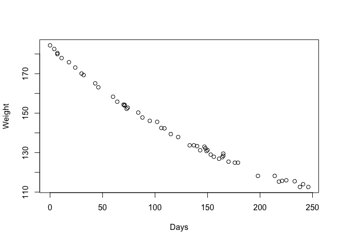
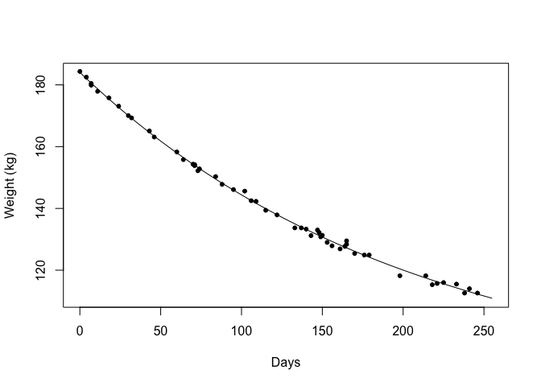
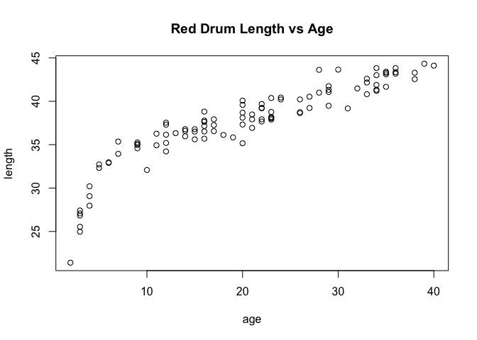
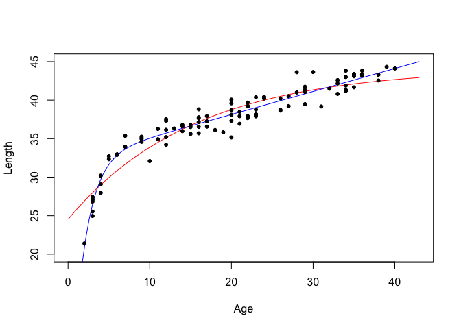

# Problem 1 (Verzani problem 13.1)

*The data set `tastesgreat` (**UsingR**) is data from a taste test for* New Goo,
*a fictional sports-enhancement product. Perform a logistic regression to
investigate whether the two covariates, `age` and `gender`, have a significant
effect on the enjoyment variable, `enjoyed`.*


#### Solution

The data is Bernoulli (enjoyed, or didn't enjoy), so we use logistic regression:

```r
data("tastesgreat")

newGooFit <- glm(enjoyed ~ age + gender, family = binomial, data = tastesgreat) #use binomial for logistic models

summary(newGooFit)
```

```
## 
## Call:
## glm(formula = enjoyed ~ age + gender, family = binomial, data = tastesgreat)
## 
## Deviance Residuals: 
##      Min        1Q    Median        3Q       Max  
## -1.84192  -0.88512  -0.06624   0.74655   2.55961  
## 
## Coefficients:
##             Estimate Std. Error z value Pr(>|z|)   
## (Intercept) -8.18443    3.09644  -2.643  0.00821 **
## age          0.16491    0.06519   2.530  0.01142 * 
## genderMale   2.42241    0.95590   2.534  0.01127 * 
## ---
## Signif. codes:  0 '***' 0.001 '**' 0.01 '*' 0.05 '.' 0.1 ' ' 1
## 
## (Dispersion parameter for binomial family taken to be 1)
## 
##     Null deviance: 55.452  on 39  degrees of freedom
## Residual deviance: 38.981  on 37  degrees of freedom
## AIC: 44.981
## 
## Number of Fisher Scoring iterations: 5
```
At the $\alpha = 0.05$ significance level, age and gender both have a significant effect on the enjoyed variable. It appears that older males are more likely to enjoy the goo.
</br>

# Problem 2 (Verzani problem 13.5)

*The `esoph` data set contains data from a study on esophageal cancer. The data
records the number of patients with cancer in `ncases` and the number of
patients in the control group with `ncontrols`. The higher the ratio of these
two variables, the worse the cancer risk. THree factors are recorded: the age of
the patient (`agegp`), alcohol consumption (`alcgp`), and tobacco consumption
(`tobgp`).*

*We can fit an age-adjusted model of the effects of alcohol and tobacco
consumption with an interaction as follows:*


```r
res.full <- glm(cbind(ncases, ncontrols) ~ agegp + tobgp * alcgp, data = esoph,
                family = binomial)
```

*A model without interaction is fit with*


```r
res.add <- glm(cbind(ncases, ncontrols) ~ agegp + tobgp + alcgp, data = esoph,
               family = binomial)
```

*Use `AIC()` to compare the two models to determine whether an interaction term
between alcohol and tobacco is hinted at by the data.*

#### Solution


```r
AIC(res.full)
```

```
## [1] 233.9412
```

```r
AIC(res.add)
```

```
## [1] 221.3918
```
AIC for the model without interaction is slightly better, which suggests that an interaction term between alcohol and tobacco is *not* present.
</br>


# Problem 3 (Verzani problem 13.8)

*The data set `wtloss` (**MASS**) contains weight measurements of an obese
patient recorded during a weight-rehabilitation program. The variable `Weight`
records the patient's weight in kilograms, and the variable `Days` records the
number of days since the start of the program. A linear model is not a good
model for the data, as it becomes increasingly harder to lose the same amount of
weight each week. A more realistic goal is to lose a certain percentage of
weight each week. Fit the nonlinear model*

$$\text{Weight} = a + b 2^{-\text{Days}/c}.$$

*The estimated value of $c$ would be the time it takes to lose $b$ times half
the excess weight.*

*What is the estimated weight for the patient if he stays on this program for
the long run? Suppose the model held for 365 days. How much would the patient be
expected to weigh?*

#### Solution

Let's start by graphing the data to see what it looks like:

```r
plot(Weight~Days, data = wtloss, pch = 21)
```


</br>

As stated, the data is nonlinear. Now we can fit the nonlinear model:

```r
weightModel <- function(a, b, c, days){
   a + b*2^(-1*days/c)
}

weightFit <- nls(Weight ~ weightModel(a, b, c, Days), data = wtloss,
                 start = c(a=20, b=20, c=20))

summary(weightFit)
```

```
## 
## Formula: Weight ~ weightModel(a, b, c, Days)
## 
## Parameters:
##   Estimate Std. Error t value Pr(>|t|)    
## a   81.374      2.269   35.86   <2e-16 ***
## b  102.684      2.083   49.30   <2e-16 ***
## c  141.911      5.295   26.80   <2e-16 ***
## ---
## Signif. codes:  0 '***' 0.001 '**' 0.01 '*' 0.05 '.' 0.1 ' ' 1
## 
## Residual standard error: 0.8949 on 49 degrees of freedom
## 
## Number of iterations to convergence: 5 
## Achieved convergence tolerance: 5.028e-06
```


```r
fittedWeightModel <- function(fit) {
  a <- coef(fit)["a"]
  b <- coef(fit)["b"]
  c <- coef(fit)["c"]
  
  function(days){
     weightModel(a,b,c,days)
  }
}

fit_function <- fittedWeightModel(weightFit)
curve(fit_function(x), from = 0, to = 255, xlab = "Days",
      ylab = "Weight (kg)")
points(Weight ~ Days, data = wtloss, pch = 20)
```


</br>

And by plotting the model over top of the data, we see that it looks like an accurate fit.

Now to estimate the patient's weight if they continued the program for 365 days:

```r
predict(weightFit, data.frame(Days = c(365)), type = "response")
```

```
## [1] 98.64172
```
Based on the fitted model, after 365 days the patient's weight is predicted to be ~99lbs.
</br>

# Problem 4 (Verzani problem 13.9)

*The `reddrum` (**UsingR**) data set contains length-at-age data for the red
drum fish. Try to fit both the models*

$$l = b_0\left(1 - e^{-k(t - t_0)}\right)$$

*and*

$$l = (b_0 + b_1 t) \left(1 - e^{-k(t - t_0)}\right).$$

*(These are the von Bertalanffy and "linear" von Bertalanffy curves.) Use the
AIC to determine which is preferred.*

*Good starting values for the "linear" curve are 32, 1/4, 1/2, and 0.*


```r
plot(length~age, data = reddrum, main = "Red Drum Length vs Age")
```



```r
f1 <- function(b0, k, t, t0){
   b0 * (1 - exp(-1 * k*(t - t0) ) )
}

f2 <- function(b0, b1, k, t, t0){
   (b0 + b1*t) * (1 - exp(-1 * k*(t - t0) ) )
}

fit1 <- nls(length ~ f1(b0, k, age, t0), data = reddrum, start = c(b0=32, k=.25, t0=0))
fit2 <- nls(length ~ f2(b0, b1, k, age, t0), data = reddrum, start = c(b0=32, b1=30, k=.25, t0=0))

AIC(fit1)
```

```
## [1] 378.1829
```

```r
AIC(fit2)
```

```
## [1] 308.6806
```
From AIC results, the 'linear' von Bertalanffy curve function gives the more accurate fit.


```r
fittedF1 <- function(fit) {
  b0 <- coef(fit)["b0"]
  k <- coef(fit)["k"]
  t0 <- coef(fit)["t0"]
  
  function(age){
     f1(b0, k, age, t0)
  }
}

fittedF2 <- function(fit) {
  b0 <- coef(fit)["b0"]
  b1 <- coef(fit)["b1"]
  k <- coef(fit)["k"]
  t0 <- coef(fit)["t0"]
  
  function(age){
     f2(b0, b1, k, age, t0)
  }
}

f1Curve <- fittedF1(fit1)
f2Curve <- fittedF2(fit2)

curve(f1Curve(x), from = 0, to = 43, xlab = "Age",
      ylab = "Length", col = "red", ylim = c(20, 45), xlim = c(0, 43))
curve(f2Curve(x), from = 0, to = 43, col = "blue", add = TRUE)

points(length~age, data = reddrum, pch = 20)
```



From the graph, it appears that $l = (b_0 + b_1 t) \left(1 - e^{-k(t - t_0)}\right).$ (blue curve) fits better at lower ages, but $l = b_0\left(1 - e^{-k(t - t_0)}\right)$ better fits the 'tapering off' of length when age increases.
